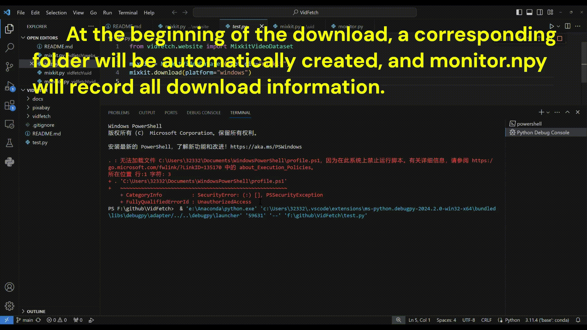

<div align="center">

</div>


``Latte``, **a novel latent diffusion transformer for video generation**, utilizes spatio-temporal tokens extracted from input videos and employs a series of Transformer blocks to model the distribution of videos in the latent space. ``Latte`` achieves state-of-the-art performance on four standard video generation datasets ``FaceForensics``, ``SkyTimelapse``, ``UCF101``, and ``Taichi-HD``. [paper](https://arxiv.org/pdf/2401.03048v1.pdf), [code](https://github.com/Vchitect/Latte?tab=readme-ov-file), [pretrained](https://huggingface.co/maxin-cn/Latte)


However, ``Latte`` still falls short in terms of video generation length and quality compared to ``Sora``. To achieve training and generation effects close to Sora, the Latte model requires more high-quality text-video paired datasets. Therefore, we have created ``VidFetch``, an open-source dataset download tool to obtain copyright-free videos from various free video websites.


## Free Video Support

| website | windows | macos | linux |
| :-----: | :-----: | :---: | :---: |
| [Pexels](https://www.pexels.com) | ✔ | 📆 | 📆 |
| [Mazwai](https://mazwai.com/stock-video-footage) | 📆 | 📆 | 📆 |
| [Mixkit](https://mixkit.co/free-stock-video) | ✔ | 📆 | ✔ |
| [Pixabay](https://pixabay.com/videos/search/?order=ec) | ✔ | 📆 | 📆 |
| [Coverr](https://coverr.co/stock-video-footage) | 📆 | 📆 | 📆 |


## How to use

**Install related dependency packages**
```bash
pip install -r doc/requirements.txt
```


**You only need three lines of code to start downloading the video**
```python
from vidfetch.website import MixkitVideoDataset

mixkit = MixkitVideoDataset(root_dir="mixkit")
mixkit.download(platform="windows")
```
<details>
<summary>Click to view examples we have implemented</summary>

- Download videos from Mixkit

<div></div>

- When you interrupt the download, the monitor will record the video information you downloaded successfully last time and continue downloading based on this information

<div></div>

</details>

## VidFetch's design philosophy

